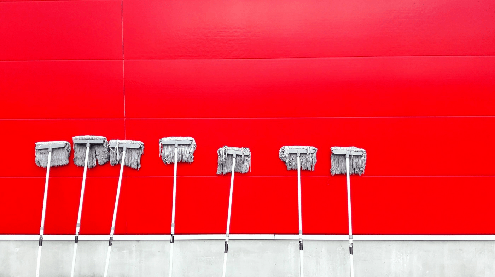

# Remove unused resources
 
 

## What it do
- Unused swift functions and variables.
- Unused localized strings.
- Unused image resources.
- Visualizing dependency graphs in the project.

## How to use it
- Save the file to a folder named scripts in your root directory and add it to your post build script in Xcode.

- Build your project and you should now see any errors or warnings caused by your localizable files, click on the report navigator for details on which keys or files caused the issue.

## 🚀 Contributing
⚙ Made by: Mohamed Gamal

⚙ inspired by: Gino Wu
